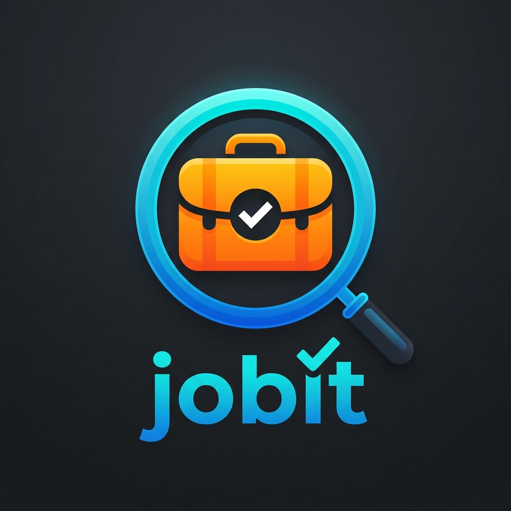
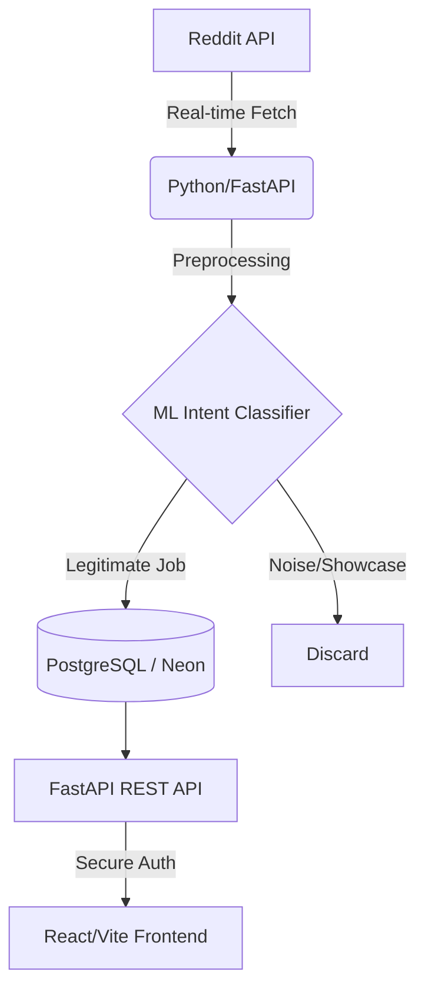

#  JobIt

**JobIt** is a premium, AI-powered job aggregator that surface hidden opportunities from Reddit's top hiring communities. By combining real-time scraping, intelligent ML classification, and a sleek glassmorphism interface, JobIt turns the chaos of Reddit into a structured, professional job hunting experience.

---

## 🏗️ Architecture & Data Flow



---

## 🚀 Key Features

### 🧠 AI-Powered Smart Filtering
Unlike simple keyword search, JobIt uses a **Multinomial Naive Bayes** classifier to analyze the intent behind every post.
- **Vectorization**: TF-IDF with (1, 2) n-grams.
- **Precision**: Effectively filters out "Showcases," "Portfolio Pushes," and general questions.
- **Confidence Threshold**: Ensures only high-probability hiring posts reach your dashboard.

### 🌐 Universal Aggregation
Automated scraping of niche and global subreddits:
- r/forhire, r/jobs, r/internships
- r/DataScience, r/MachineLearning, r/Python
- Creative niches (Motion Graphics, Graphic Design)

### 🔐 Multi-Channel Authentication
Secure access through a flexible auth system:
- **Google OAuth**: Fast, one-click sign-in.
- **Phone OTP**: Secure verification via SMS (Twilio).
- **Manual**: Traditional Email/Password registration.

### 🎨 Modern Glassmorphism UI
A state-of-the-art dashboard built for focus:
- **Dark/Light Mode**: Dynamic theme switching.
- **Responsive Design**: Seamless experience across mobile and desktop.
- **Interactive Stats**: Real-time tracking of new and paid listings.

---

## ⚙️ Tech Stack

- **Backend**: Python (FastAPI), SQLAlchemy, Pydantic
- **Machine Learning**: Scikit-learn (TF-IDF + Naive Bayes)
- **Frontend**: React (Vite), CSS3 (Modern Glassmorphism)
- **Authentication**: Google OAuth 2.0, Twilio (OTP), JWT
- **Database**: PostgreSQL (Neon.tech)
- **Deployment**: Render (Backend/Scraper), Vercel (Frontend)

---

## ⚡ Quick Start

### 1. Prerequisites
- Python 3.11+
- Node.js 18+
- PostgreSQL Database

### 2. Backend Setup
```bash
# Clone the repo
git clone https://github.com/aadimandavia/jobit.git
cd jobit

# Setup virtual environment
python -m venv venv
venv\Scripts\activate   # Windows

# Install dependencies
pip install -r requirements.txt

# Run the setup/scraper
python run_scraper.py

# Start API
uvicorn app.main:app --reload
```

### 3. Frontend Setup
```bash
cd frontend-react
npm install
npm run dev
```

---

## ☁️ Deployment Plan

### 🔹 Backend & Scraper (Render)
The FastAPI app and the automated scraper are deployed to **Render**. A background worker or cron job triggers `run_scraper.py` every **4 hours** to ensure fresh data.

### 🔹 Database (Neon)
A serverless PostgreSQL instance on **Neon** provides high-availability storage for thousands of aggregated job listings.

### 🔹 Frontend (Vercel)
The React dashboard is optimized for production and deployed to **Vercel** for lightning-fast global delivery.

---

## 👤 Developer

**Aadi Mandavia**
- 🌍 [GitHub](https://github.com/aadimandavia)
- 💼 [LinkedIn](https://linkedin.com/in/aadi-mandavia-006571259)
- ✉️ [Email](mailto:aadim2612@gmail.com)

---

## 📜 License
MIT License. Created with ❤️ for the development community.
